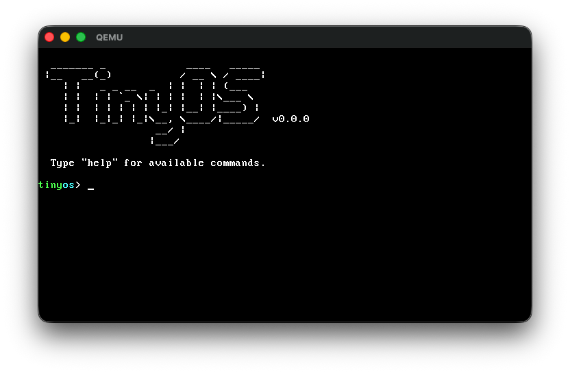
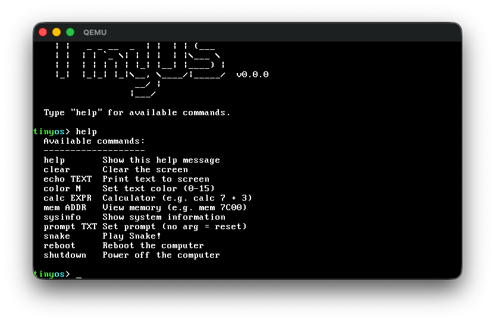

# TinyOS

A minimal x86 operating system that fits in 8KB. Boots from a CD/ISO image into a colorful shell with built-in commands and a Snake game.





## Features

- Interactive shell with command history (up/down arrows, 8 entries) and backspace support
- Colored prompt and ASCII art banner
- Configurable text colors (16 colors)
- Built-in signed calculator with `+`, `-`, `*`, `/`
- Hex memory viewer/inspector
- System information display
- Playable Snake game with score tracking
- APM power-off support
- Fits entirely in a single boot image (no filesystem needed)

## Commands

| Command         | Description                                                          |
|-----------------|----------------------------------------------------------------------|
| `help`          | Show available commands                                              |
| `clear`         | Clear the screen                                                     |
| `echo TEXT`     | Print text to screen                                                 |
| `color N`       | Set text color (0-15)                                                |
| `calc EXPR`     | Calculator (e.g. `calc 12 + 5`)                                      |
| `mem ADDR`      | View 64 bytes at hex address (e.g. `mem 7C00`, `mem 0`, `mem B800`)  |
| `prompt TEXT`   | Set custom prompt (no args to reset to default)                      |
| `sysinfo`       | Display system information                                           |
| `snake`         | Play Snake (arrow keys, `q`/ESC to quit)                             |
| `reboot`        | Reboot the computer                                                  |
| `shutdown`      | Power off the computer (APM)                                         |

## Building

### Prerequisites

- [NASM](https://nasm.us/) — assembler
- [xorriso](https://www.gnu.org/software/xorriso/) — ISO creation tool

```bash
# macOS
brew install nasm xorriso

# Debian/Ubuntu
sudo apt install nasm xorriso

# Arch Linux
sudo pacman -S nasm xorriso

# Fedora
sudo dnf install nasm xorriso
```

### Build

```bash
./build.sh
```

This produces `tinyos.iso` (~376KB).

## Running

### With QEMU (recommended)

```bash
# macOS
brew install qemu

# Then run
qemu-system-x86_64 -cdrom tinyos.iso
```

### On real hardware

Burn the ISO to a CD or USB drive and boot from it:

```bash
# USB (replace /dev/sdX with your device)
dd if=tinyos.iso of=/dev/sdX bs=4M status=progress
```

Then set your BIOS to boot from the CD/USB drive.

## How it works

TinyOS is a single x86 assembly file (`boot.asm`) that runs in 16-bit Real Mode. It uses the El Torito CD-ROM boot specification — the BIOS loads the boot image directly into memory at `0x7C00` and jumps to it.

- **Video**: Direct VGA text-mode memory writes at `0xB800` for the Snake game and colored prompt; BIOS `int 0x10` for general text output
- **Input**: BIOS `int 0x16` for keyboard (blocking and non-blocking polling)
- **System info**: BIOS `int 0x12` for memory detection
- **Timing**: BIOS `int 0x15` function `86h` for Snake game delay, tick counter at `0040:006C` for RNG
- **Power**: APM BIOS `int 0x15` functions `5301h`/`530Eh`/`5307h` for shutdown

No protected mode, no GDT, no filesystem, no external dependencies at runtime.

## Project structure

```
boot.asm    — the entire OS (assembler source)
build.sh    — build script (assemble + create ISO)
```

## License

Public domain. Do whatever you want with it.
